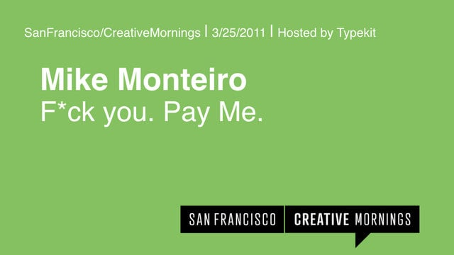

# Contracts 

## Overview
The only control you truly have is of yourself. Clients and Projects will do (and need to) change at their own will. Contracts help:

* Mitigate planned (and unplanned) changes to Projects
* Establishes understanding of roles Client-to-Designer, budgets, dates, legalities, and expectations 
* All contracts can be litigated. Seek legal console to write your contracts given and understand contracts received

## Questions
* Do you always need a contract 100% of the time? 
* Do contracts 100% protect you, your Clients or your Employer?
* What are key components of a contract? 

## Downloads
* [Contract Components (MS Word)](https://github.com/vcd/480/raw/master/docs/your-project/contracts/downloads/480-Contract.docx)
* [Contract Components (Pages)](https://github.com/vcd/480/raw/master/docs/your-project/contracts/downloads/480-Contract.pages)
* Examples: [Sample A](https://github.com/vcd/480/raw/master/docs/your-project/contracts/downloads/sample-1.pdf) | [Sample B](https://github.com/vcd/480/raw/master/docs/your-project/contracts/downloads/sample-2.pdf) | [Sample C](https://github.com/vcd/480/raw/master/docs/your-project/contracts/downloads/sample-3.pdf)

## References
* [Fuck You Pay Me by Mike Monteiro](https://vimeo.com/22053820) | Notes from [Fuck You Pay Me](docs/your-project/contracts/notes-fuckyou-payme.md)
* [Contracts for Creatives](https://www.lynda.com/Business-Skills-tutorials/Contracting-Creatives/508540-2.html?srchtrk=index%3a2%0alinktypeid%3a2%0aq%3acontracts%0apage%3a1%0as%3arelevance%0asa%3atrue%0aproducttypeid%3a2)